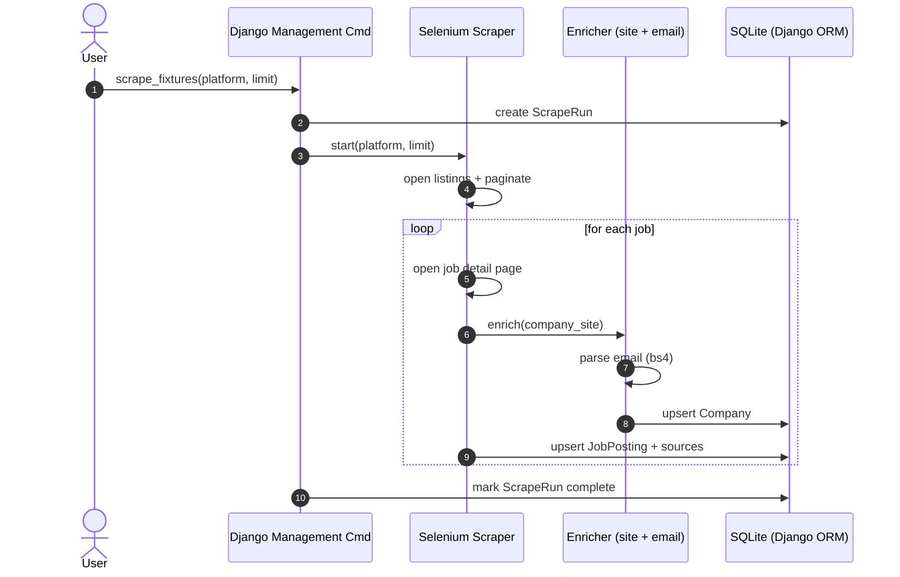

# Recruitment Intel (Portfolio-Safe Demo)

A **portfolio-safe** Django + Selenium project that demonstrates:
- Backend development with **Django** and relational models
- Robust **Selenium** scraping patterns (waits, retries, pagination)
- Job data normalization + **deduplication/merge** across platforms
- "Company website + email" enrichment (implemented via **local fixtures**)
- A minimal **HTML/CSS dashboard**

✅ **Safe to upload online**: uses local HTML fixtures and synthetic data generated from `PLAN.csv` (no proprietary URLs, selectors, or business data).

## Quick start

```bash
python -m venv .venv
source .venv/bin/activate  # (Windows: .venv\Scripts\activate)
pip install -r requirements.txt

cd recruitment_intel
python manage.py migrate
python manage.py seed_fixtures
python manage.py runserver
```

Open the dashboard:
- http://127.0.0.1:8000/

Run a scrape (from fixtures):
```bash
python manage.py scrape_fixtures --platform indeed --limit 10
python manage.py scrape_fixtures --platform glassdoor --limit 10
python manage.py scrape_fixtures --platform linkedin --limit 10
```

## How it works

### Workflow
1. User triggers a scrape run (platform + limit)
2. Selenium loads fixture listing pages and follows pagination
3. For each job card, Selenium opens the job detail page and extracts:
   - title, location, company, description, source url
4. Enrichment:
   - company website comes from the job page
   - email is extracted by crawling the local company page and parsing `mailto:` links (BeautifulSoup)
5. Storage:
   - Django models store Company + JobPosting + Platform + ScrapeRun
6. Dedup/Merge:
   - Jobs are deduplicated by `(normalized_title, company, location)`
   - Multiple sources for the same job are merged into a single record

### Sequence diagram


## Notes on real platforms
This demo intentionally avoids scraping real platforms that may restrict automation. For production usage, follow each site's Terms of Service and robots policy, and prefer official APIs when available.

## Data provenance
The fixture pages and synthetic job listings are generated locally from `PLAN.csv` to demonstrate ingestion + normalization. No original proprietary system identifiers, URLs, or selectors are used.
